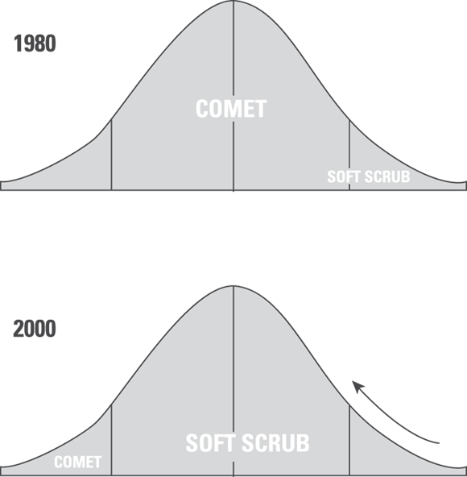
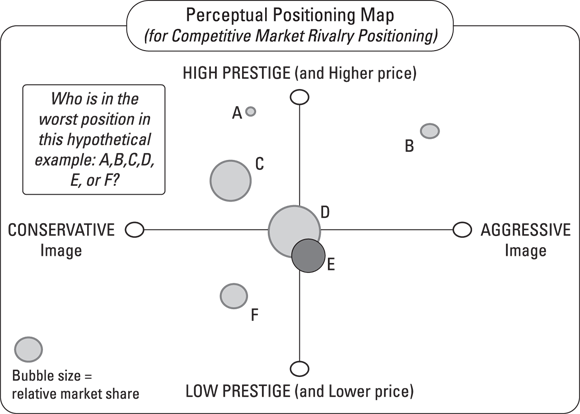

# 寻找目标市场

本章内容

* 评估目标市场
* 选择合适的行业
* 找准细分市场
* 衡量最具吸引力的客户
* 选择行业价值链上的最佳位置

创建伟大企业的最重要一步是提供客户想要并愿意购买的产品或服务。这被称为强大的产品或服务。创建强大产品或服务的第一步是选择正确的市场。选择合适的行业吸引力、细分市场吸引力和客户吸引力的组合，为你的产品创造了最佳市场。

通过结合行业吸引力、细分市场吸引力和客户吸引力，你可以了解整体市场潜力。本章从此将这种组合称为市场吸引力。市场吸引力是你业务最重要的方面之一。很难想象一个在行业不佳、细分市场狭小且客户糟糕的市场中销售的企业能够强大

## 衡量目标市场

你应该找到一个盈利且足够大的市场细分。然而，为了拥有一个成功且持久的企业，你需要找到一个尚未被满足或服务不足的大型市场。找到这个服务不足的市场至关重要。

任何人都能找到巨大的市场去开拓。嘿，我们卖咖啡吧！这个市场很大，而且还在增长，对吧？然而，已经有几家大而成功的公司已经占有了这个市场的一部分。通常来说，在完全相同的细分市场中攻击一个已建立的竞争对手并不是明智之举。传统上，先动者或现有者会赢得胜利。

> 如果你想进入咖啡市场，你需要找到一个星巴克等公司尚未服务或服务不足的可行市场细分。为了简化，你可以将任何目标市场分解为四个部分：

* 这个行业本身有多吸引人？例如，软件公司通常比建筑公司更有利可图。Scott A. Shane教授为他的书《The Illusions of Entrepreneurship: The Costly Myths That Entrepreneurs, Investors, and Policy Makers Live By》（耶鲁大学出版社）进行了研究。这项研究提供了重要的数据，表明某些行业比其他行业更具可行性和盈利能力。当然，商业模式的其他方面对整体盈利能力也有很大影响。
* 行业内的细分市场有多吸引人？通常，包装软件开发商比定制软件开发商更有利可图。你想选择一个最有潜在盈利能力的细分市场。
* 目标客户群体有多具吸引力？星巴克瞄准的高端客户比麦当劳瞄准的客户更有利可图。具吸引力的客户不一定非要富裕客户。具吸引力的客户是能让你的商业模式发挥最佳效果的人。例如，许多有利可图的商业模式正在为无银行账户（没有支票账户的人）创造。有关商业模式的介绍，请参阅第一本书的第三章。
* 这个细分市场是否足够大，能为你提供进入的机会，并销售足够多的产品或服务，以一个能让你创造可行业务的价格点？为宠物狗做假肢可能是个好主意，但你能否以足够高的价格销售足够多的假肢，从而通过这种方式赚到钱？

## 确定行业吸引力

行业是你将进入的业务的广义类别或定义。以下是一些行业的例子：

* 汽车后市场制造
* 商业咨询
* 总包
* 家庭改造
* 草坪和花园分销
* 法律服务
* 医疗
* 宠物护理
* 住宅景观设计
* 软件开发

在一个广泛的行业中，通常定义了细分行业领域，这些领域进一步细化了产品或服务。以下是一些例子：

* 车辆制造业包括重型卡车、电动汽车、休闲车等细分领域。
* 餐饮行业包括快餐、高档餐饮、休闲餐饮等细分领域。
* 服装制造商有运动服、男士西装、内衣、女士商务装和婚纱等细分领域。
* 医疗行业有全科医生、外科医生、足病医生、整体疗法医生、眼科医生等细分领域。
* 暖通空调（供暖、通风和空调）行业有轻型、锅炉和重型系统等细分领域。

你更有可能在“好”的行业里成功，而不是在“差”的行业里。在一个好的行业里，大多数公司都能成功；例如软件开发、矿产开采和保险行业。在一个差行业里，利润率历来很低，并且/或者竞争过于激烈；例如航空公司和建筑行业。然而，你可以找到许多进入吸引力不强的行业但最终成功的公司例子，因为它们在其他方面的商业模式很强。例如，Waste Management（垃圾处理）、Apple（计算机硬件）、Nike（鞋子）和 Vistaprint（商业印刷）。

> 如果你选择一个有吸引力的行业，你将有更大的成功机会。考虑以下因素：

* 这个行业整体是增长还是萎缩？
* 这个行业在十年后是否强大？
* 这个行业中有多少现有竞争者，他们有多强大？
* 你是否看到这个产业有机会与现有市场重叠（融合）？
* 该行业能否与您现有的业务部分产生强大的协同效应？

第一本书，第一章更多地讨论了研究你选择的行业。

在确定了有吸引力的行业后，你需要确定该市场中最佳的部分，即利基市场，然后确定在该利基市场中要服务的最佳客户。在一个有吸引力的行业中工作是很有帮助的，但它不是必需的。许多优秀的商业模式是在不良行业中通过划分有吸引力的客户细分市场或利基市场（或两者兼有）而创建的。

例如，Vistaprint 创造了一个出色的商业模式，服务于那些没人想做的客户（微型企业）和没人想进入的行业（印刷）。Vistaprint 通过利用高度差异化的销售、分销和成本模式取得了成功。

有句老话说：“人人都以为他们懂得如何经营餐厅，因为他们会吃饭。”每个行业和生意都可以学习。然而，如果你不熟悉某个行业，就要做好付出艰苦努力才能尽快入门的准备。

在选择行业时，要记住商业环境总是在不断变化。加油站过去是修理汽车的地方；现在它们开始卖甜甜圈和三明治。展望未来可以帮助你判断所选行业是否有边缘增长机会或潜在威胁。

> 市场和行业有什么区别？
>
> 许多商人使用"市场"这个词来泛指行业、细分市场、利基市场和客户（换句话说，谁会为你提供的产品付费）。虽然简单地提及市场更方便，但将问题分解成更小的部分能让你更深入地了解你的商业模式。然而，这些概念之间是相互渗透的。如果你的行业利基是电动汽车，你的客户细分很可能由你生产电动汽车这一事实决定。两者相辅相成，相互渗透。
>
> 当行业、细分市场、利基市场或客户细分不能完全涵盖所有方面时，"市场"这个词最适用。行业应该指行业和行业细分市场。

### 找到最佳行业

为你的商业模式选择一个有吸引力的行业可能看起来很简单。关键在于研究（有关如何进行研究，请参阅第一本书，第一章）。你应该做的一件事是尽可能多地收集关于当前和未来趋势的独立信息。通过这样做，你能够为你的模式做出最佳的行业选择。以下是一些获取行业数据和趋势的地方：

* 付费服务，如 Gartner ( <www.gartner.com> ) 和 Forrester Research ( <www.forrester.com> )
* 商业类出版物和新闻媒体，如《商业周刊》（ <www.businessweek.com> ）、《商业周刊》（ <www.inc.com> ）、《巴伦周刊》（ <www.barrons.com> ）和 CNN 商业（ <www.cnn.com/business> ）
* 书籍
* 行业贸易出版物

> 使用行业贸易出版物作为资源时要注意避免偏见。这类出版物会对行业进行最积极的宣传。例如，尽管像 Priceline.com 和 Expedia.com 这样的网站已经开始破坏部分业务，但 2000 年时的旅游行业贸易出版物可能仍然对行业持积极态度。

* 行业协会
* 个人经验
* 美国国税局或州政府（查看某个行业新成立或申请破产的企业数量）

> 没有专有信息，你选择行业时使用的数据与你的竞争对手相同。商业本质上具有风险。再多的研究也无法替代在市场上的时间。总有一天，你会完成你的研究并做出最佳猜测，那时你需要冒险一试。

### 在服务不足的市场工作

未被满足或服务不足的市场比大多数市场提供显著更好的机会。服务不足的市场具有增长潜力且竞争较小。将自己定位在服务不足的市场中，你的商业模式将更加强大。市场之所以服务不足，是因为

* 市场正在增长，而服务这个市场的供应商却太少。大多数新企业都在追逐这个经典市场。像安卓应用开发、社交媒体平台、3D 打印和乘客太空旅行这样的市场就是例子。
* 市场停滞不前或萎缩，供应商纷纷逃离。竞争中的过度纠正可能会创造机会。
* 市场被认为缺乏吸引力。一些可能的原因：
  * 感知的盈利能力：Rent-A-Center 在其他人认为风险过高的市场中盈利。
  * 感知规模：沃尔玛发现了一个服务于人口少于 20,000 的城镇的市场，而竞争对手则专注于大城市。
  * 缺乏吸引力：像移动厕所、造纸和盐矿这样的市场远不如 iPhone 应用程序开发那样具有吸引力，但正因为这种缺乏吸引力，它们也能提供机会。
  
有些市场之所以服务不足，是有原因的。仔细审视市场机会，摘下玫瑰色的眼镜，对自己残酷诚实——然后根据所有标准做出选择。

## 寻找细分市场的吸引力

在你为你的商业模式挑选一个有吸引力的行业（见前文）之后，就该寻找一个有吸引力的细分市场了。你的细分市场是你参与的整体市场的子集。

### 了解一个良好细分市场的力量

选择正确的细分市场可能比选择正确的行业更为重要。例如，Vistaprint 成立于 1995 年，当时传统印刷行业正遭受重创。在 1990 年代和 21 世纪初，成千上万的印刷商倒闭。在那段时间里，Vistaprint 成长为一个价值数十亿美元的企业。当其他印刷商急剧缩小时，Vistaprint 是如何成长的呢？Vistaprint 瞄准了那些被认为对传统印刷商来说规模过小的微利和小型企业。结合巧妙的技术利用，Vistaprint 将无利可图的客户转变为全球最赚钱的印刷业务之一。

### 存在无限细分市场

好消息！在任何市场中，你都可以找到无限细分领域。许多成功公司的策略核心，正是创造或完善新的细分领域。以下是一些例子：

* 潘那亚面包：面向快餐行业的更健康、更高品质的三明治。
* 哈根达斯：高端冰淇淋，价格是其他冷冻甜点行业冰淇淋的三倍。
* 星巴克：不只是杯咖啡——是一种体验。你可以认为星巴克属于餐饮行业，它确实如此。然而，星巴克也与其他便利店竞争咖啡销售。无论哪种情况，其细分市场都是那些想要完整星巴克咖啡体验的顾客。
* 麦当劳：快速、一致的食品。如今，餐厅业务中的这一细分市场已经成熟且竞争激烈，但当麦当劳起步时，它是一个全新且未被开发的市场。通过迎合那些想要快速食品中一致性的顾客，麦当劳主导了这一细分市场。
* Coach：日常奢华。Coach 手袋比百货公司的品牌更时尚，但比高级时尚品牌的价格要合理得多。这个介于高级时尚和百货公司之间的细分市场为 Coach 和其他日常奢华品牌取得了很好的效果。
* iPad：一款电子邮件和互联网玩具。苹果公司在笔记本电脑、Gameboy 和智能手机之间找到了一个绝佳的细分市场。

汉堡包行业能支持多少种不同的细分市场？比人们预期的要多得多。汉堡包大约在 1890 年发明，最早的汉堡包餐厅出现在 20 世纪 20 年代。从那时起，出现了数十种制作汉堡包的创新方式。以下是部分汉堡包连锁店及其细分市场的列表。

| 链 | 细分市场 |
| ------ | ----- |
| McDonald’s | 儿童汉堡连锁店 |
| Wendy’s | 成人汉堡连锁店 |
| Red Robin | 美食汉堡 |
| White Castle | 诱人的滑块 |
| Rally’s | 仅限 drive-through |
| Five Guys | 简单、更新鲜的汉堡和薯条 |

### 市场有分化的习惯

随着市场的成熟，它们往往会分化出越来越多的细分市场。曾经只占市场一小部分的细分市场可能会变得非常庞大。五十年前，磨砂清洁剂如 Comet 主导了家用清洁剂市场。1977 年，Clorox 公司推出了细分市场的清洁剂 Soft Scrub。这款产品对于那些寻找偶尔替代硬磨砂清洁剂的人来说市场有限。随着时间的推移，乳状清洁剂成为了家用清洁剂市场最大的细分市场。现在你可以找到如 Cerama Bryte 炉灶清洁剂这样的细分市场乳状产品，用于特殊用途。

如果你将整体市场视为一个钟形曲线，其中最大的市场存在于钟形曲线最宽的部分，那么最佳的市场细分存在于市场的边缘。将左边缘视为低成本选项，右边缘视为高成本选项。图 4-1 展示了家用清洁剂市场的钟形曲线。

曾经，像 Comet 这样的干洗店占据了市场的大部分份额。Soft Scrub 作为一款液体专业清洁剂进入市场，处于市场的边缘地带。Soft Scrub 吸引了那些不想在干洗店使用强磨蚀性清洁剂的顾客。随着时间的推移，液体清洁剂相对于干洗剂的吸引力逐渐增强，Soft Scrub 取代了 Comet 成为市场的主要部分（钟形曲线最宽的部分）。Comet 则被归到市场最不吸引人的部分（左侧边缘），吸引那些对价格敏感、愿意使用传统清洁剂的顾客。

钟形曲线的两端都提供了各种利基市场。沃尔玛通过为小镇买家提供低成本百货商店，在左翼边缘找到了一个利基市场。如今，沃尔玛代表了钟形曲线的较宽部分，而美元店则在左翼边缘开辟了一个利基市场。

通常，你的商业模式不应试图进入钟形曲线的脂肪部分。这些成熟市场有强大的、已确立的竞争者，通常很难在他们的游戏中击败他们。相反，寻找一个边缘去攻击（如图 4-2 所示）。很可能，已确立的竞争者不会想离开他们的大市场来打扰你的小利基——至少目前不会。

在艾尔·里斯和杰克·特劳特的经典营销著作《营销的 22 条铁律》（HarperBusiness）中，他们指出营销者的目标是打造出像 Kleenex 或 Jell-O 这样的品牌。Kleenex 是纸巾，Jell-O 是果冻。Xerox 是复印机。这些品牌创造了新的细分市场，并如此强势地主导了该细分市场，以至于市场用品牌名称来重新命名该类别。这是细分市场创造的黄金标准。

### 寻找未开发或服务不足的市场

创造一个良好细分市场的最佳方式是找到尚未被满足或服务不足的市场。所有爆款产品都是这样做的。没有人购买手机是因为它本身；人们购买它是为了它的功能——例如，在开车时让他们感觉更安全、更有效率。手机的服务不足市场不是更好的手机，而是能够在以前不可能的情况下进行沟通的能力。

什么是未被充分服务的市场？如果市场明显存在未被充分服务的情况，市场中的现有参与者就会填补这一空白。在预测什么是未被充分服务时，需要一些猜测。你必须运用商业判断，然后进行猜测。只有市场知道需要什么，而了解这一点的唯一方法就是将产品推向市场。

有时候很容易发现一个未被充分服务的市场。一个快速发展的郊区需要主要零售地点的加油站、餐馆和服务。智能手机使用的指数级增长创造了比所需应用程序更快的服务用户。

> 如果你选择一个容易识别的增长领域的细分市场，要记住竞争对手也能轻易找到这个细分市场。预计会有大量的竞争。

与其选择显而易见的细分市场，不如愿意冒险选择一个不太明显的细分市场。如果每个人都通过写 iPhone 和 Android 应用程序来追逐手机增长，不妨冒险尝试微软应用程序。对于小公司来说，拥有一个竞争不那么激烈的细分市场，可能比在大型市场中做一个非常渺小的参与者更有利。

你如何找到这些难以寻觅的未开发或服务不足的市场？

* 个人经历：许多优秀的产品和公司都是由企业家对现状的不满而创造出来的。当弗雷德·史密斯构思联邦快递时，他想知道为什么信件不能隔夜送达。在意大利旅行时，星巴克的霍华德·舒尔茨想知道为什么欧洲风格的咖啡馆在美国行不通。
* 朋友和家人：如果你不是那种走在时代前沿的人，可以看看你的朋友们。他们在购买哪些产品和服务？为什么？他们希望解决哪些问题？
* 研究趋势：你不必追逐趋势才能找到一个绝佳的利基市场；然而，追逐趋势可以使你的利基市场变得更好，因为增长是内建的。
* 聘请专家：专业的商业计划书撰写人、商业模式顾问、未来学家或其他专家可以帮助你找到利基市场。
* 运气：Angie’s List（现名为 Angi）成立于 1995 年，当时互联网尚未普及。Angie’s List 最初只是每月向会员发送的包含家庭承包商评价的小册子。它的流行主要集中在那些维修频繁且昂贵的传统社区。Angie’s List 曾是一个小本生意，从未想过会掀起滔天巨浪，最终成为其细分领域的领导者。当互联网颠覆了 Angie’s List 的商业模式时，它也使其变得更好。Angie’s List 不再只是一个地方性的推荐小册子印刷商，而是建立了一个综合网站。

### 尝试感知位置映射

一个简单的工具可以帮助你在所选市场中找到合适的细分市场，这个工具叫做感知位置映射。它根据你的研究告诉你的两个最重要的变量——顾客在选择购买特定市场类别的产品时感知的变量——在一个简单的 2x2 矩阵上映射当前竞争对手。例如，价格和质量，高或低。（注意：仅限于两个变量的限制是因为一张平面的纸只有一个平面；一些基于计算机的技术允许进行多变量映射——称为“多维缩放”（MDS）——这种技术能生成更复杂的分析，分析顾客在考虑购买时寻找的内容，并且有三个、四个或更多按排名或加权顺序的变量。）观看这个简短的 YouTube 视频了解差异： <www.youtube.com/watch?v=fotcfkEXLJ0> 。

看看图 4-3 中男士运动夹克的假设感知定位图。假设市场调研告诉你，最重要的两个变量是价格（高与低）和风格（保守与激进）。

那么，如果你正在考虑进入市场，你应该将自己定位在哪里？关于感知定位的一些观察：

* 细分市场就是空白地带：感知图的假设前提是，你不想让你的产品定位与竞争对手完全（或几乎）相同，因为如果你被这样感知，买方的决策过程几乎完全取决于价格，低价者胜出（参见假设地图中的“D”和“E”现有竞争者）。相反，你应该分析地图，寻找“空白”地带——那些目前没有产品提供的市场细分领域。简而言之，你想要与竞争对手区分开来，因为再次强调，如果现有竞争者被感知为完全相同，顾客就会将它们视为普通商品，并选择最低价格（为什么为类似的东西支付更多费用呢？）战略差异化等于银行里的钞票！
* 最大的市场处于最不利的地位：在感知图中，虽然现有企业“D”拥有最大的市场份额，但它实际上处于最不利的地位！什么？是的，因为这是典型的“陷入中间”案例的说明——对客户没有明确的市场定位。在一个客户有选择权（所谓的“可竞争”市场）中，他们会寻找满足其特定需求的产品。但现有企业“D”既不是最时尚的，也不是最传统的，价格既不是最高的，也不是最低的。品牌只是存在——如果我们可以引用一位著名文学泰斗的话，“那里什么都没有。”现有企业“D”被竞争对手击败了。
* 为什么这个品牌（“D”）拥有最高的市场份额？过去处于“夹在中间”位置的企业往往是创新者，可能最早进入市场，并获得了率先进入市场带来的收益。随着率先行动者的成功吸引了竞争对手——这是常有的事——新进入者试图差异化自己，从而为消费者提供了更多选择，并开始蚕食率先行动者的市场份额。
* 这家率先行动的公司是如何回应的呢？又是一个经典的商业失误，这次是“肥、笨、乐”（FD&H syndrome）的典型表现。“嘿，没错，我们上个季度可能失去了一两成的市场份额，但看看这些所谓的竞争对手的价格和利润率。他们离我们的盈利能力差远了，如果我们降价，只会损害我们的形象。至于高端市场呢？老实说，那个细分市场太小了，根本不值得我们去那里。”

如此这般，一个又一个无力的借口，为无所作为和失去市场辩护，起初缓慢，随后如雪崩般接连不断——死亡源于千疮百孔。一个持续存在的谜团是市场领导者为何不创新，正如管理学大师克莱顿·克里斯坦森所创造的所谓“创新者的困境”。也就是说，害怕变革——创新——会蚕食现有产品的销售额。

> 当你思考合适的市场细分可能在哪里时，可以使用感知图工具来引导你的思考，甚至可以使用人工智能平台来协助你。这项技术已经存在，它应该能够在原本需要的时间的一小部分内，为你感知图提供一个初步方案。Google Sheets 是一个不错的起点： <www.thebricks.com/resources/guide-how-to-make-a-perceptual-map-in-google-sheets-using-ai> 。
>
>
> 当你在地图上找到位置并前往那里时，永远不要忽视竞争对手。成功并不总是自我奖励，至少从长远来看不是如此；在残酷的商业世界中，它通常是竞争的温床。最好的商业公司——我们说的是你，伙计——学会同时为短期和长期思考并行动。

## 评估客户吸引力

你可以创造一个有吸引力的市场细分（参见前文），但可能被不良客户破坏。有吸引力的客户对你的产品有强烈需求，他们认为解决方案的价值超过产品成本（这是一个强大的价值主张），有可支配收入来购买你的产品，能按时支付账单，并且数量足够多，使你的企业能够盈利。

大多数商业模式中的客户既不特别吸引人也不特别不吸引人。大多数商业模式不需要长期专注于客户吸引力，因为古老的箴言“所有客户都是好客户”在大多数时候都是正确的。然而，你确实需要研究客户吸引力。

获得最具吸引力顾客的最突出例子就是零售界的箴言“地段，地段，还是地段。”一个出色的零售地点能为你带来什么？出色的顾客，这就是答案。高端零售购物中心无论位于何处，都具有相同的行业吸引力和细分市场吸引力。无论购物中心位于最热门的新郊区还是农田中央，行业和细分市场吸引力都保持不变。然而，热门新郊区的高收入顾客通常被认为比农村地区的顾客更具吸引力。

> 更富裕的客户并不使一个市场细分更具吸引力。通常，更富裕的客户能够负担得起为商品和服务支付更高的价格。高利润通常伴随着这些更高的价格，但也可能因为更高的管理费用和更低的销量（由于更高的排他性）而被抵消。仅仅追求富裕客户并不总是最佳策略。记住那句古老的谚语：“面向大众销售，与精英共存；面向精英销售，与大众共存。”

例如，Rent-A-Center 与 Best Buy 同属一个行业。两家公司存在一些细分市场的重叠，但它们服务的客户群体差异很大。Best Buy 服务于能够全额购买电视机的客户。这些客户要么有现金，要么有预先安排的融资，如信用卡。Rent-A-Center 则服务于信用额度较低的客户。Rent-A-Center 向传统零售商（如 Best Buy）认为信用不良的买家提供信贷。Rent-A-Center 接受客户的月度或周度付款，直到商品全额付清。由于它们服务的客户群体不同，Rent-A-Center 的商业模式与 Best Buy 的商业模式差异很大：

* Best Buy 服务于更多经济状况更稳定的买家，并通过传统的零售商业模式——买入和卖出商品来赚钱。
* Rent-A-Center 更像是一家以销售家电为副业的专门金融机构。由于 Rent-A-Center 不会一次性收取全额付款，该公司拥有比 Best Buy 更多的利润来源。金融手续费、贷款高额利息、更多的业务构成了 Rent-A-Center 的大部分利润。

许多企业会认为 Rent-A-Center 的客户不够理想。然而，Rent-A-Center 建立了一个盈利的商业模式。由于 Rent-A-Center 的商业模式考虑到了零星和偶尔的未付款情况，因此这是一个可行的商业模式。

> 作为商人，你必须消除或在商业模式中解释不良客户的存在。如果你遇到十个建筑行业的商人，你很可能会遇到一个因为慢付款或无付款的客户而使生意破产的人。错误的客户可能会摧毁一个可行的商业模式。

有趣的是，你可以在自己的客户细分市场中再细分出一个客户细分市场。你的产品针对特定的细分市场或利基市场进行营销。然而，任何利基市场中的客户，无论多么紧密，都是多种多样的。手提包填补了 Target 商店可以找到的日常包和巴黎可以找到的高端包之间的利基市场。在这个利基市场中，你可以找到一些穿着比较随意、追求日常奢华的中产阶级路易威登客户。

你需要回答的问题是营销活动针对哪个细分市场。以手袋为例，营销活动显然是针对寻求日常奢华的中产阶级买家。

这里再举一个例子：星巴克吸引了咖啡行业中最为富裕和受追捧的顾客。然而，在星巴克的细分市场中，有那些为了买一杯 5 美元的拿铁而经济拮据的买家，也有那些每月在星巴克花费数百美元的买家。星巴克瞄准的细分市场是那些将星巴克视为生活方式选择的顾客，而不仅仅是喝一杯咖啡。

## 找到你在行业价值链中的位置

你想找到行业价值链上最好的位置。每家参与将产品从初始创造到最终消费者购买和消费的公司都在以活动形式增加价值，同时产生成本，并形成最终利润。这条价值链上的某些位置比其他位置提供更大的机会。

不同行业对价值链上的位置有不同的重视程度。例如，服装零售商在其价值链上的位置比服装制造商更有利可图。在汽车行业，零售商的收入往往低于制造商。在一些行业，价值链上没有理想的位置可供选择，这使得整个市场对你的业务来说不太有吸引力。

想想一杯咖啡。有多个运营商为你的日常咖啡增添价值。然而，市场对某些活动的回报远比其他活动丰富得多。如果你的商业模式要取得最大成功，你希望占据价值链中利润潜力最大的位置。表 4-1 展示了咖啡的价值链。

| 公司 | 增值 | 关键活动 |
| ------ | ---------- | ---------- |
| 咖啡豆种植者 | 运营 | 农业 |
| 货运 | 物流 | 运输和物流 |
| 咖啡烘焙机 | 运营 | 将咖啡豆转化为可饮用的咖啡 |
| 营销人员（福格勒斯、星巴克） | 销售 | 品牌、销售、客户服务 |
| 零售商 | 销售 | 商品销售 |

咖啡价格时涨时落，但涉及的原理不会改变。假设整颗的哥伦比亚生咖啡豆售价为每磅 1.97 美元。假设农民的成本约为其一半。那么农民的利润为每磅咖啡 0.985 美元。烘焙商从农民处以每磅 1.97 美元的价格购买咖啡，并将其运输、烘焙和研磨。物流和运输成本约为每磅 0.02 美元。烘焙商然后将咖啡卖给咖啡服务公司、消费品公司或零售商。无品牌的批发咖啡售价约为每磅 5 美元。如果咖啡烘焙商的运营成本约为每磅 3.03 美元增值价值的一半，那么咖啡烘焙商的利润约为每磅 1.51 美元。如果咖啡有品牌（如星巴克、福杰斯、西雅图最佳），则增值价值会额外增加一至两美元。请注意，几乎所有由品牌带来的增值都会转化为利润/利润。最后，像星巴克、福杰斯、克罗格或咖啡服务这样的公司会将咖啡交付给消费者。福杰斯咖啡售价为每磅 9.99 美元（星巴克每磅 13.95 美元）。因此，福杰斯零售商增加了约 4 美元的增值（主要是利润）。 这涵盖了 1 磅装咖啡的整个价值链。

表 4-2 显示了每个职能增加的价值和大致的利润率。请注意，与产品制造相关的职能相比，市场营销和销售相关的职能获得了更丰厚的回报。

| 公司 | 每磅成本增加 | 每磅赚取的利润 | 总增值 |
| ------ | ---------- | ---------- | ------- |
| 咖啡豆种植者 | $0.985 | $0.985 | $1.97 |
| 货运 | $0.015 | $0.005 | $.02 |
| 咖啡烘焙机 | $1.52 | $1.51 | $3.03 |
| 营销人员（福格勒斯、星巴克） | $0 | $2 | $2 |
| 零售商 | $2 | $2 | $4 |

> 咖啡价值链上的某些环节比其他环节更有利可图。为了最大化你的商业模式的有效性，找到价值链中最有利可图的环节。通常，你越靠近终端用户或消费者，利润空间就越大。不要误解这句话。最好的商业模式可能不是零售模式。但随着制造业转移到低工资国家，制造和相关活动的附加值急剧下降。随着制造业增加价值的能力下降，通过销售、分销和品牌建设增加价值的能力却提高了。这种转变为精明的企业家提供了机会。

精明的企业家们还创造了价值链上的新职位，以从现有参与者手中切割价值。例如，在法律领域，一些新参与者出现了，他们切割了传统上由律师拥有的价值链的一部分。印度的律师事务所专门从事大规模复杂研究。一些公司审计律师事务所的账单，试图为客户节省开支。这两个行业曾经都是律师事务所价值链的一部分。

讽刺的是，工作量或工作难度与价值链中增加的价值量之间似乎几乎没有关联。正如从咖啡的例子中可以看出，最辛苦的工作是由农民完成的。农民承担着恶劣天气的风险，拥有最多的员工，并且按比例投入了最多的工时。然而，在价值链中，农民获得的收入最少。

> 价值链的某些环节往往比其他环节能增加更多价值。请注意，增加的价值是销售价格与成本之间的差额。某项产品可能占最终消费者总销售价格的大百分比，但在价值链上增加的价值却很少。
